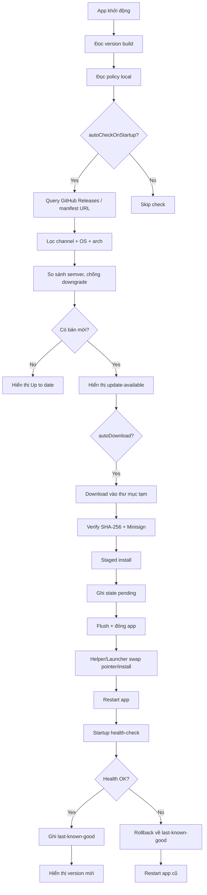

# Architecture

> **Cập nhật:** 2026-07-29
> **Trust sources:** `plan/TRUST-SOURCES.md` — mọi version phải trace về file đó.

## 1. Framework & Version đã khóa

| Thành phần | Go | Rust | Lý do chọn | Trust source |
|---|---|---|---|---|
| Desktop framework | Wails v2.13.0 (stable) | Tauri 2.11.5 (stable) | Cả hai đều stable, hỗ trợ WebView trên Windows | TS-01, TS-04 |
| Updater core | `go-selfupdate v1.6.0` (check+download) + tự viết staged install | `tauri-plugin-updater 2.10.1` (check+download+verify+install+restart) | Go: Wails v3 không có updater service (TS-03). Rust: plugin chính thức | TS-07, TS-05 |
| Signature | Minisign (Ed25519) qua `aead.dev/minisign v0.3.0` | Minisign (Ed25519) qua `tauri-plugin-updater` | Thống nhất format ký giữa 2 bản | TS-10b, TS-14 |
| Manifest format | `manifest-go.json` (superset theo §7) | `latest-rust.json` (native Tauri) | Mỗi framework đọc format riêng | TS-13 |
| Installer | Launcher + versioned dirs + pointer (tự viết) | NSIS installer do Tauri bundler tạo, `installMode: passive` | Go: không có core → tự viết. Rust: có sẵn | — |
| Restart mechanism | `exec.Command` hoặc launcher helper | `app.restart()` qua `tauri-plugin-process` | — | TS-15 |
| Rollback mechanism | Đổi pointer về last-known-good (atomic) | Chạy lại installer version trước (đã cache) | Tauri không có built-in rollback → tự viết adapter | Issue #3 |

## 2. Mapping manifest fields

| Prompt §7 field | Go `manifest-go.json` | Rust `latest-rust.json` (native Tauri) | Ai xử lý |
|---|---|---|---|
| version | `version` | `version` | Server manifest |
| channel | `channel` | (không có — Tauri không koncept channel) | Go client policy |
| publishedAt | `publishedAt` | `pub_date` | Server manifest |
| releaseNotes | `releaseNotes` | `notes` | Server manifest |
| minSupportedVersion | `minSupportedVersion` | (không có) | Go client policy |
| platform | `platform` | `platforms.<target>` key | Server manifest |
| url | `url` | `platforms.<target>.url` | Server manifest |
| sha256 | `sha256` | (không có — Tauri dùng signature thay hash) | Go client verify |
| signature | `signature` | `platforms.<target>.signature` | Server manifest |
| size | `size` | (không có) | Go client verify |
| mandatory | `mandatory` | (không có) | Go client policy |

**Note:** Tauri updater dựa vào **Minisign signature** để verify, không dùng SHA-256. Go app verify **cả SHA-256 và Minisign** (defense in depth).

## 3. Cơ chế install/rollback khác nhau

| | Go (Wails v2) | Rust (Tauri 2) |
|---|---|---|
| **Install dir** | `%LOCALAPPDATA%/go-demo/versions/<version>/` | `%LOCALAPPDATA%/rust-demo/` (Tauri quản lý) |
| **Pointer** | `%LOCALAPPDATA%/go-demo/current` → chứa path version đang chạy | (N/A — Tauri/NSIS quản lý) |
| **Staged install** | Download → verify → extract vào `versions/<new>/` → đổi pointer | NSIS installer: app thoát → installer chạy → app mới |
| **Tránh ghi đè** | Mỗi version 1 thư mục, không bao giờ ghi đè file đang chạy | NSIS handle file lock (chờ app thoát) |
| **Rollback** | Đổi pointer về `last-known-good` (tức thì, atomic) | Chạy lại installer version trước (chậm hơn) |
| **Health-check** | Tự viết (`updater/health.go`) | Tự viết (`src-tauri/src/updater/health.rs`) |

## 4. Luồng update (Mermaid)

## 5. Giới hạn framework đã ghi nhận

| # | Giới hạn | Hành động | Trạng thái |
|---|---|---|---|
| 1 | Wails v3 vẫn Alpha (alpha.102), không có updater service trong `v3/pkg/services` | Dùng Wails v2 stable + go-selfupdate | ✅ Đã quyết định |
| 2 | Tauri 2 không có built-in rollback | Tự viết adapter `rollback.rs` | ⏳ P4 |
| 3 | Tauri 2 không có built-in health-check | Tự viết adapter `health.rs` | ⏳ P4 |
| 4 | Agent Linux không build Windows được | CI (T2) + user (T3) kiểm chứng | ✅ Đã thiết kế |
| 5 | `jedisct1/go-minisign` tag không có `v` prefix | Thay bằng `aead.dev/minisign v0.3.0` | ✅ Đã fix |
